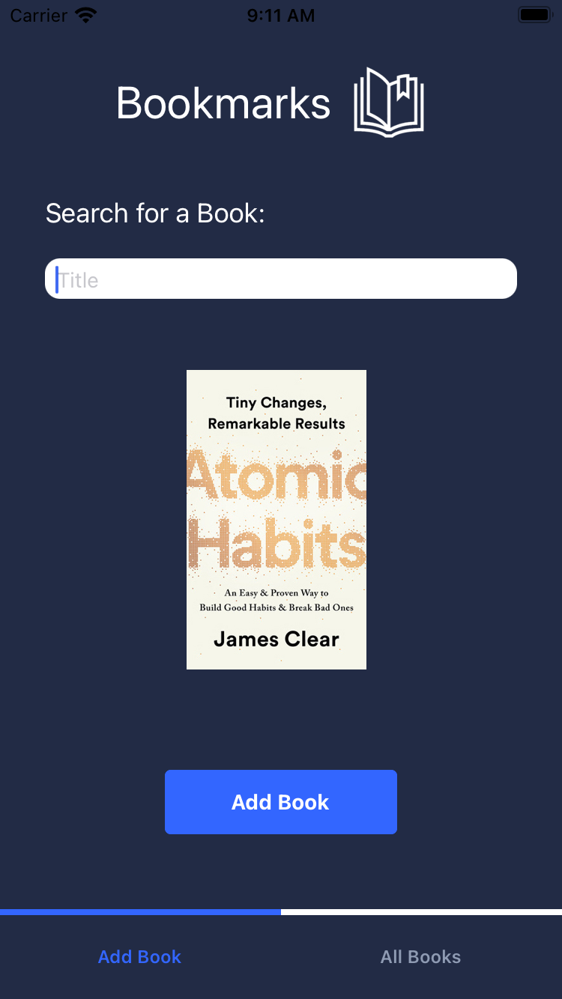

# Bookmarks

<h2> Project Idea </h2>

This goal of this project is to allow users to create bookmarks from books they are currently reading to highlight important chapters and sections. This would allow them to keep a log of books they have read and their thoughts/insights along the way. A real-world usage for this app would act as a way for people from around the world to have an opportunity to share their thoughts, interpretations, and questions about chapters, pages, and passages like an asynchronous book club.

<h2>User Story</h2>

A user will be able to search for books to add to their current reading list. After doing so, they can navigate to their reading list and add 'bookmarks's of notes to their books

<h2>Stack</h2>

• React Native 
• Async Storage
• HTML 
• CSS 

<h2>Wireframe</h2>

<h2>Stretch Goals</h2>

Creating an attractive and dynamic UI that can use a book cover API (e.g. https://openlibrary.org/dev/docs/api/covers) to insert book covers with creating an interface that changes colors based on primary colors of the cover similar to Spotify (e.g. https://lokeshdhakar.com/projects/color-thief/). Further stretch goal would be to create 'cards' for each note.

